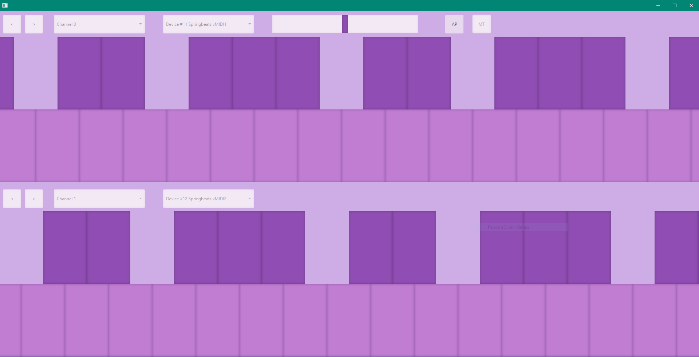

# MofMidiFXML
A multi-touch screen MIDI keyboard written in Java using JavaFX (for touch screen support). Buttons are created programmatically.

JFugue is used for semi-tone calculations and pitch-shifting.

